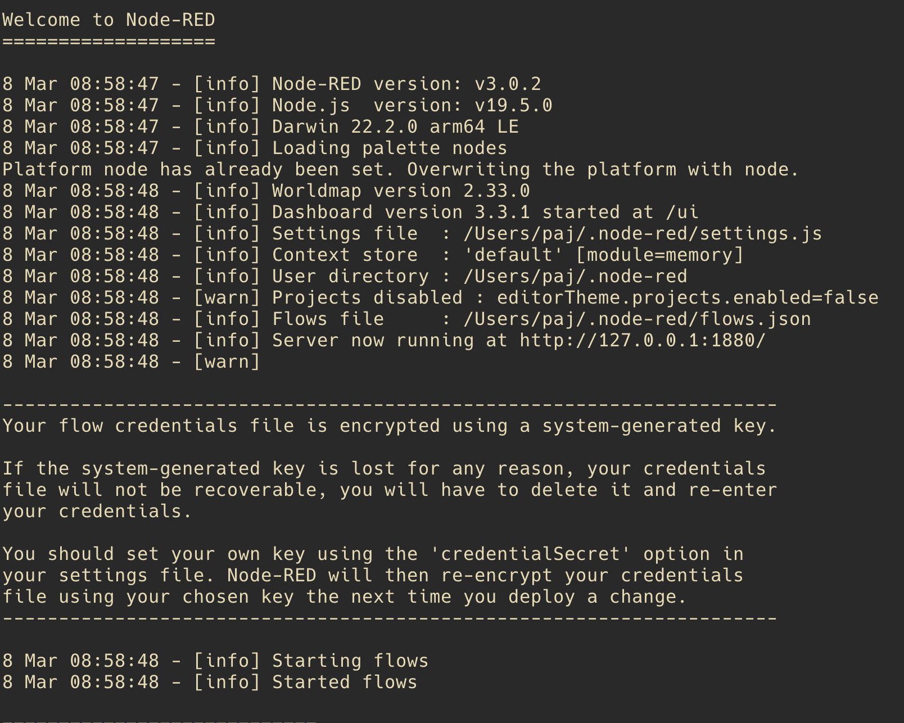
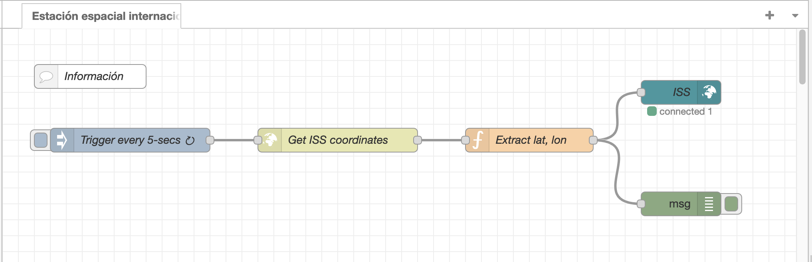
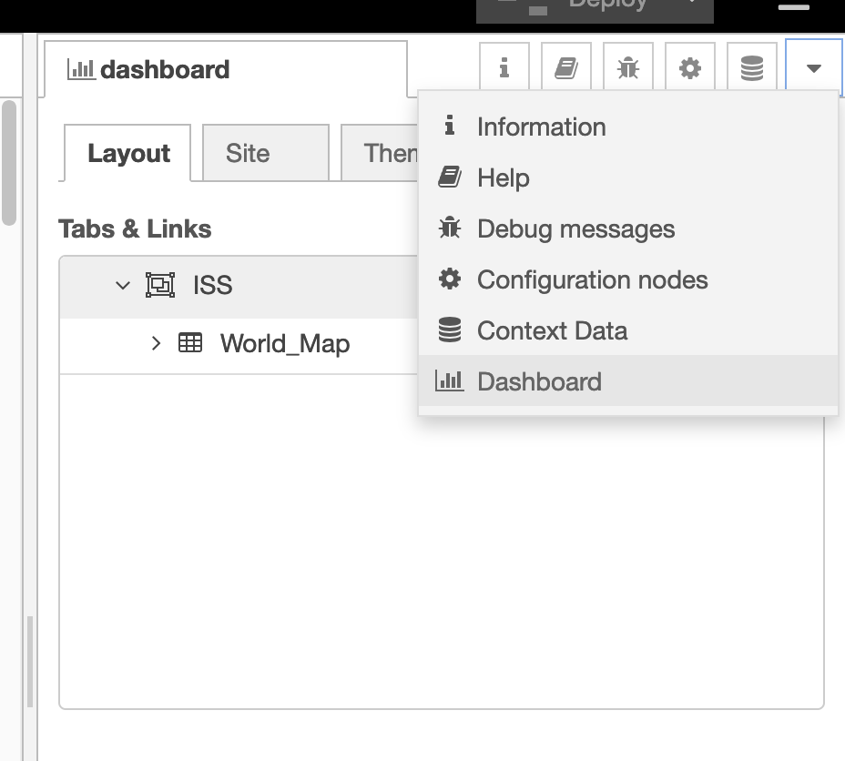
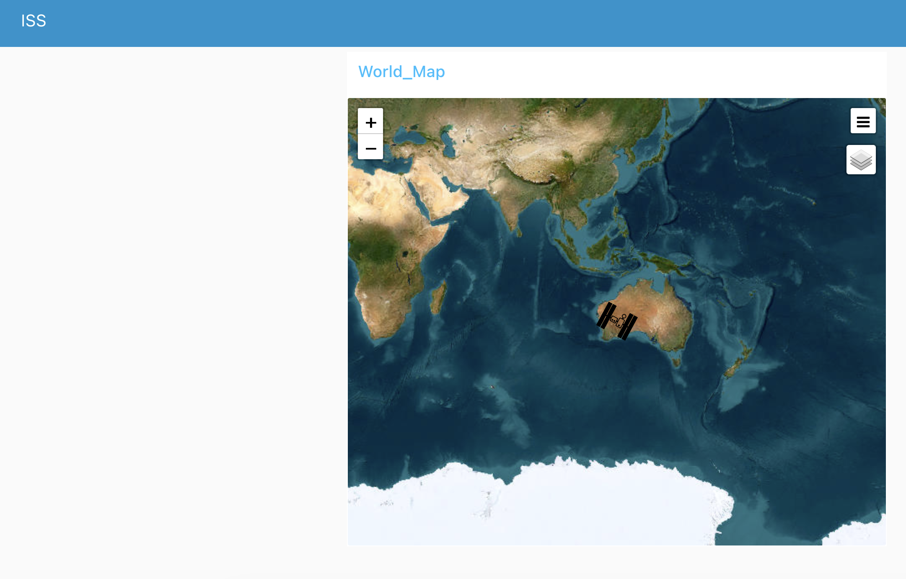
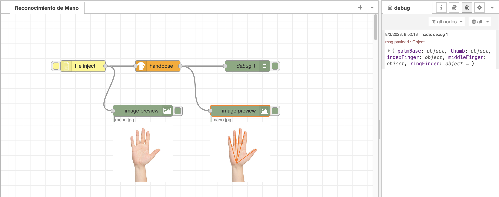
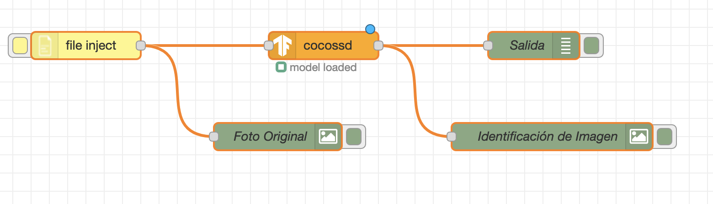
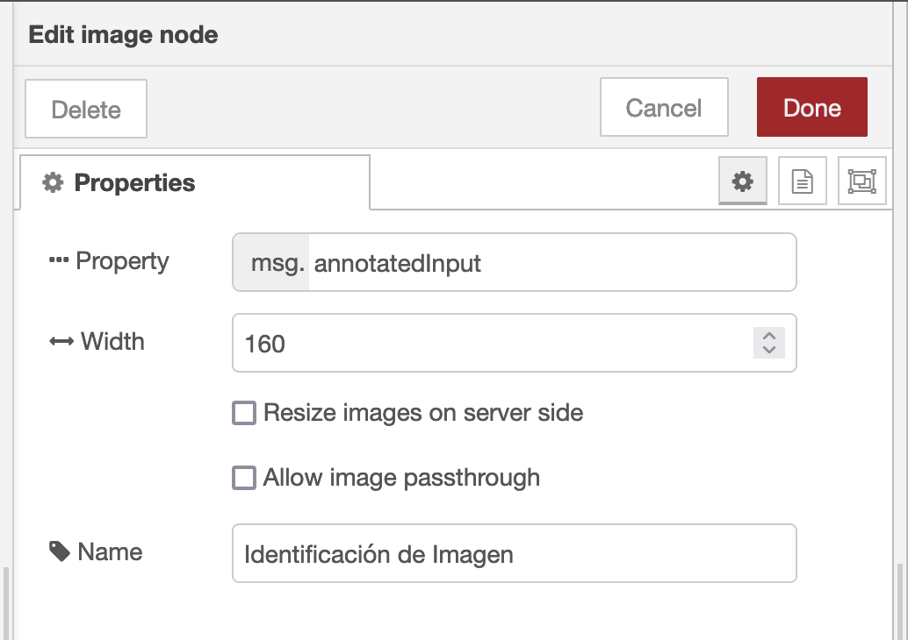
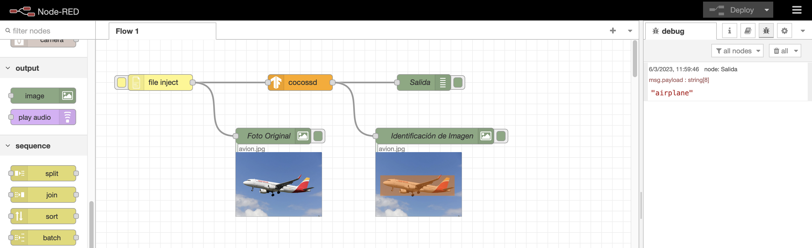

 # Ejemplo de aplicación Node RED

Vamos a ver algunos de ejemplos del uso de Node RED.

Node-RED es una herramienta de desarrollo basada en flujo para programación visual desarrollada originalmente por IBM para conectar dispositivos de hardware, API y servicios en línea como parte de la Internet de las cosas.

## Stack tecnológico
- [NodeJS](https://nodejs.org/en/), como entorno JS para ejecutar Node Red. 
- [Node RED](https://nodered.org), como herramienta de automatización.

## Instalar Node RED

    $ npm install -g --unsafe-perm node-red

## Arrancar Node RED

    $ node-red

Si todo ha ido correctamente deberiamos ver algo similar a esto:

## Acceso a la aplicación

Vamos a la url de [http://127.0.0.1:1880/](http://127.0.0.1:1880/) 

## Creamos flujo de trabajo

### Estación espacial internacional

Son necesarias las siguientes dependencias:

- node-red-dashboard
- node-red-contrib-web-worldmap

Crearemos un flujo de trabajo para permitir localizar la estación espacial internacional en un mapa.

Una vez desplegado, podemos abrir el dashboard seleccionando la opción en el menú

Esto abrirá una web con un mapa y la ubicación de la estación espacial que se refrescará cada 5 segundos

### Reconocimiento de posición de mano

Son necesarias las siguientes dependencias:

- node-red-contrib-tensorflow
- node-red-contrib-browser-utils
- node-red-contrib-image-output

Crearemos un flujo de trabajo para permitir reconocer la posición de la mano (por ejemplo mano.jpeg).

### Reconocimiento de imágenes

Son necesarias las siguientes dependencias:

- node-red-contrib-tensorflow
- node-red-contrib-browser-utils
- node-red-contrib-image-output

Crearemos un flujo de trabajo para permitir subir una imagen, reconocerla y mostrar el resultado.

En el nodo "Identificación de la imagen" cambiamos la información del mensaje a mostrar para que sea _*annotatedInput*_

Si subimos un fichero, por ejemplo de un avión, vemos que se identifica correctamente:

